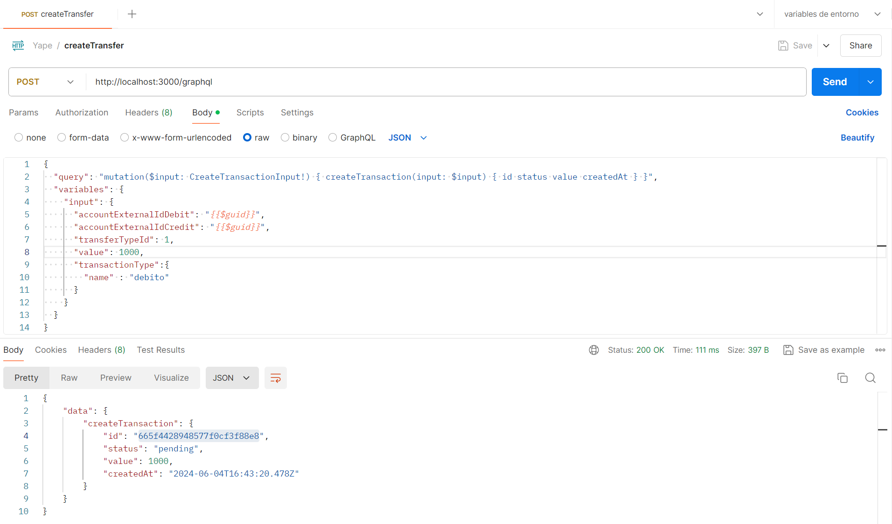
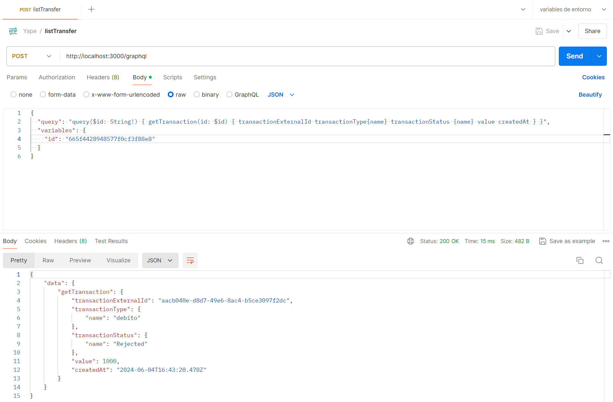
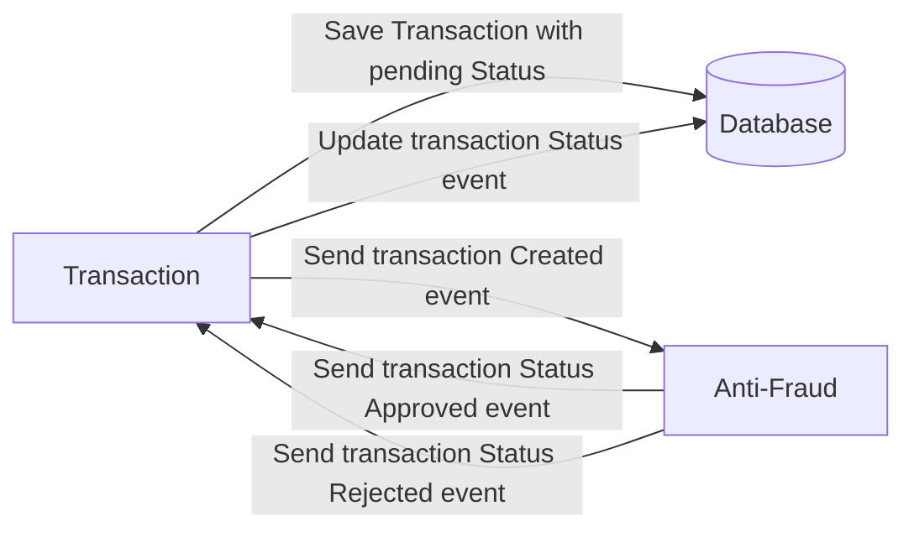

# Detalles de mi solución al desafío :rocket:
Como primer paso, he optado por utilizar MongoDB, una base de datos no relacional, para el desarrollo del proyecto. Esta elección se basa en el hecho de que MongoDB puede proporcionar un rendimiento superior en escenarios de alta concurrencia tanto en lectura como en escritura.

# Tecnologías utilizadas

1. NestJS
2. MongoDB
3. Kafka
4. GraphQL

# Cómo ejecutar los servicios

1. En la raíz del proyecto, ejecutar el comando `docker-compose up -d` para iniciar los servicios de Docker que contienen Kafka y MongoDB. Asegurarse de que Docker esté en funcionamiento en la máquina local antes de continuar.
   ```
   docker-compose up -d
   ```
2. Para iniciar el servicio de transacciones, abrir una consola y ejecuta el siguiente comando:
   ```
   nest start transaction-service
   ```
3. Para iniciar el servicio antifraude, abrir una nueva consola en la raíz del proyecto y ejecutar el siguiente comando:
   ```
   nest start anti-fraud-service
   ```

## Solicitudes con Postman utilizando GraphQL

### Crear transferencia:
- URL: http://localhost:3000/graphql
```json
{
   "query": "mutation($input: CreateTransactionInput!) { createTransaction(input: $input) { id status value createdAt } }",
   "variables": {
      "input": {
         "accountExternalIdDebit": "{{$guid}}",
         "accountExternalIdCredit": "{{$guid}}",
         "transferTypeId": 1,
         "value": 1000,
         "transactionType":{
            "name" : "debito"
         }
      }
   }
}
```
La función descrita en el bloque de código GraphQL tiene como objetivo realizar una mutación para crear una transacción. Aquí está la descripción funcional de los elementos involucrados:

- **Query**: Es una operación de mutación que lleva a cabo un cambio en la base de datos, en este caso, la creación de una transacción.
- **Variables**: Son los parámetros necesarios para ejecutar la mutación. En este caso:
   - **Input**: Es un objeto que contiene los detalles de la transacción que se va a crear.
      - **accountExternalIdDebit**: Representa el identificador externo de la cuenta de débito involucrada en la transacción.
      - **accountExternalIdCredit**: Representa el identificador externo de la cuenta de crédito involucrada en la transacción.
      - **transferTypeId**: Indica el tipo de transferencia que se está realizando.
      - **value**: Es el valor monetario de la transacción, en este caso, 1000.

Al ejecutar esta mutación con las variables proporcionadas, se espera que devuelva un objeto con los siguientes campos:
- **id**: Identificador único de la transacción creada.
- **status**: Estado actual de la transacción.
- **value**: Valor de la transacción realizada.
- **createdAt**: Fecha y hora en que se creó la transacción.

En resumen, esta operación de mutación permite crear una nueva transacción con los detalles especificados en las variables y devuelve la información relevante de la transacción creada.



### Listar transferencia:
- URL: http://localhost:3000/graphql
```json
{
  "query": "query($id: String!) { getTransaction(id: $id) { transactionExternalId transactionType{name} transactionStatus {name} value createdAt } }",
  "variables": {
    "id": "662094e582ee185199fda767"
  }
}
```
Funcionalmente el bloque de código GraphQL se define lo siguiente:

- **Query**: La operación realizada es una consulta (Query) que tiene como objetivo obtener información relevante de una transacción específica en la base de datos.
- **Variables**: Se utiliza una variable llamada `$id` que se espera sea de tipo String y es requerida para identificar la transacción que se desea recuperar. En este caso, se proporciona el ID "662094e582ee185199fda767".

La estructura de la consulta busca recuperar los siguientes campos de la transacción identificada por el ID `$id`:
- **transactionExternalId**: Es el identificador externo de la transacción.
- **transactionType{name}**: Contiene el nombre del tipo de transacción realizada.
- **transactionStatus{name}**: Indica el estado actual de la transacción.
- **value**: Representa el valor o monto de la transacción.
- **createdAt**: Muestra la fecha y hora en la que se creó la transacción.

En resumen, al ejecutar esta consulta GraphQL con la variable proporcionada, se espera obtener detalles específicos de la transacción correspondiente al ID "662094e582ee185199fda767", incluyendo su identificador externo, tipo, estado, valor y fecha de creación.



- Desarrollador: Luis Gustavo Garcia Reyna
- Correo: lgr.developer.07@gmail.com

# Yape Code Challenge :rocket:

Our code challenge will let you marvel us with your Jedi coding skills :smile:. 

Don't forget that the proper way to submit your work is to fork the repo and create a PR :wink: ... have fun !!

- [Problem](#problem)
- [Tech Stack](#tech_stack)
- [Send us your challenge](#send_us_your_challenge)

# Problem

Every time a financial transaction is created it must be validated by our anti-fraud microservice and then the same service sends a message back to update the transaction status.
For now, we have only three transaction statuses:

<ol>
  <li>pending</li>
  <li>approved</li>
  <li>rejected</li>  
</ol>

Every transaction with a value greater than 1000 should be rejected.



# Tech Stack

<ol>
  <li>Node. You can use any framework you want (i.e. Nestjs with an ORM like TypeOrm or Prisma) </li>
  <li>Any database</li>
  <li>Kafka</li>    
</ol>

We do provide a `Dockerfile` to help you get started with a dev environment.

You must have two resources:

1. Resource to create a transaction that must containt:

```json
{
  "accountExternalIdDebit": "Guid",
  "accountExternalIdCredit": "Guid",
  "tranferTypeId": 1,
  "value": 120
}
```

2. Resource to retrieve a transaction

```json
{
  "transactionExternalId": "Guid",
  "transactionType": {
    "name": ""
  },
  "transactionStatus": {
    "name": ""
  },
  "value": 120,
  "createdAt": "Date"
}
```

## Optional

You can use any approach to store transaction data but you should consider that we may deal with high volume scenarios where we have a huge amount of writes and reads for the same data at the same time. How would you tackle this requirement?

You can use Graphql;

# Send us your challenge

When you finish your challenge, after forking a repository, you **must** open a pull request to our repository. There are no limitations to the implementation, you can follow the programming paradigm, modularization, and style that you feel is the most appropriate solution.

If you have any questions, please let us know.
